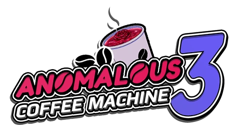
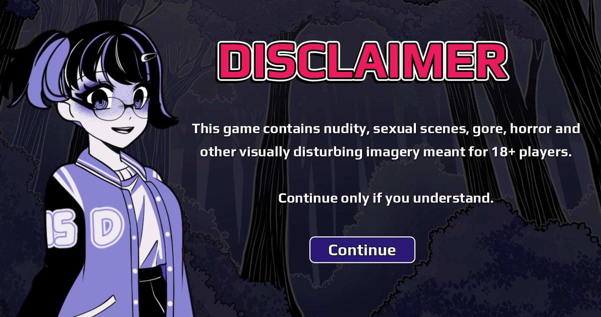
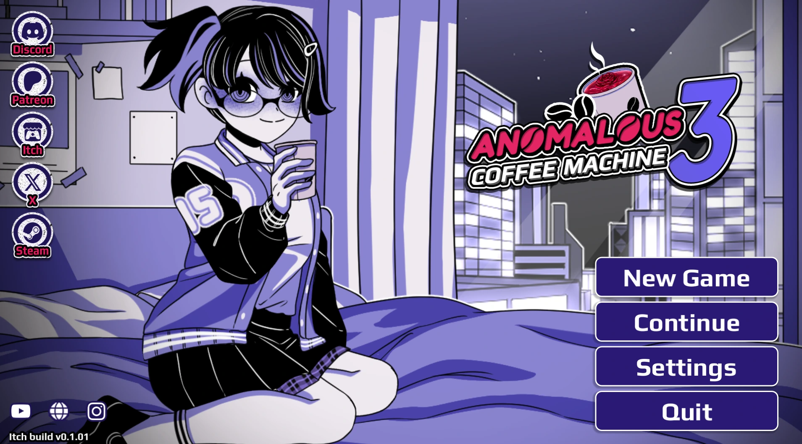
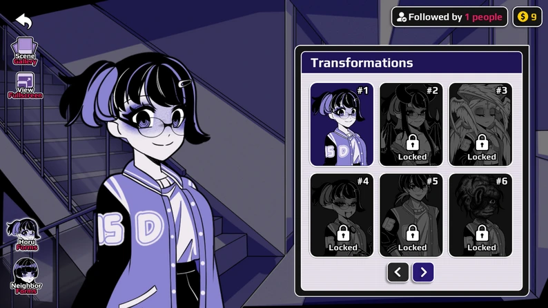
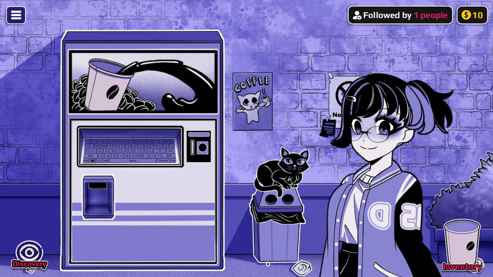

# Anomalous Coffee Machine 3

**Anomalous Coffee Machine 3** is an adults-only interactive fiction, visual novel, and light management game created by HoruBrain. This website lets players aged 18 and over play the free v0.1 browser demo online.

Horu is a work-from-home game artist trying to make rent. In the liminal stairwell between the 12th and 13th floors of her apartment building, she discovers an outdated coffee machine capable of producing drinks that should not exist. Insert a coin, type a word, and see what the machine creates.

## Play Free Online

[Play Anomalous Coffee Machine 3 in your browser](https://anomalouscoffeemachine3.com/)

No installation is required for the browser demo. The game iframe loads only after the player confirms that they are at least 18 years old.

## How to Play

1. Insert a coin and type a keyword into the machine.
2. Receive an anomalous drink based on a recognized object, emotion, place, or idea.
3. Keep the cup, drink it, offer it to a neighbor, or sell it online.
4. Discover new forms, scenes, events, and hidden combinations.
5. Attract followers, earn money, and grow Horu's unusual coffee business.

## Discover Transformations

Experimentation is the heart of the game. Different keywords can unlock drinks, transformations, dialogue, character encounters, and unexpected story outcomes. The forms collection helps track discoveries and shows how many results remain hidden.

## Meet the Neighbors

The sequel expands the original word-and-cup concept into a larger city simulation. Horu can meet other characters, share anomalous drinks, follow new conversations, and see how her experiments affect the people around her.

## Build the Business

Horu's apartment serves as a home base. Manage discoveries and inventory, sell unusual coffee online, watch follower activity, and turn a mysterious machine into a growing late-night business.

## Key Features

- Free v0.1 browser demo.
- Keyword-driven anomalous drink system.
- Interactive fiction, visual novel, simulation, and management elements.
- Inventory choices, character encounters, transformations, forms, and combinations.
- Keyboard, mouse, and touchscreen support.
- English text and subtitles.
- Browser, Windows, macOS, Linux, and Android releases listed by the creator.

## Adults Only

Anomalous Coffee Machine 3 contains explicit sexual content, nudity, disturbing imagery, horror, gore, transformation themes, and other mature material. It is intended exclusively for adults aged 18 and over. Do not play if you are under 18 or if this content is not legal in your location.

## Official Creator Pages

- [HoruBrain — Anomalous Coffee Machine 3](https://horubrain.com/game/anomalous-coffee-machine-3/)
- [Anomalous Coffee Machine 3 on itch.io](https://horubrain.itch.io/anomalous-coffee-machine-3)

> Anomalous Coffee Machine 3, its characters, artwork, and game content belong to HoruBrain and their respective rights holders. This is an unofficial browser portal and is not presented as the developer's official website.
